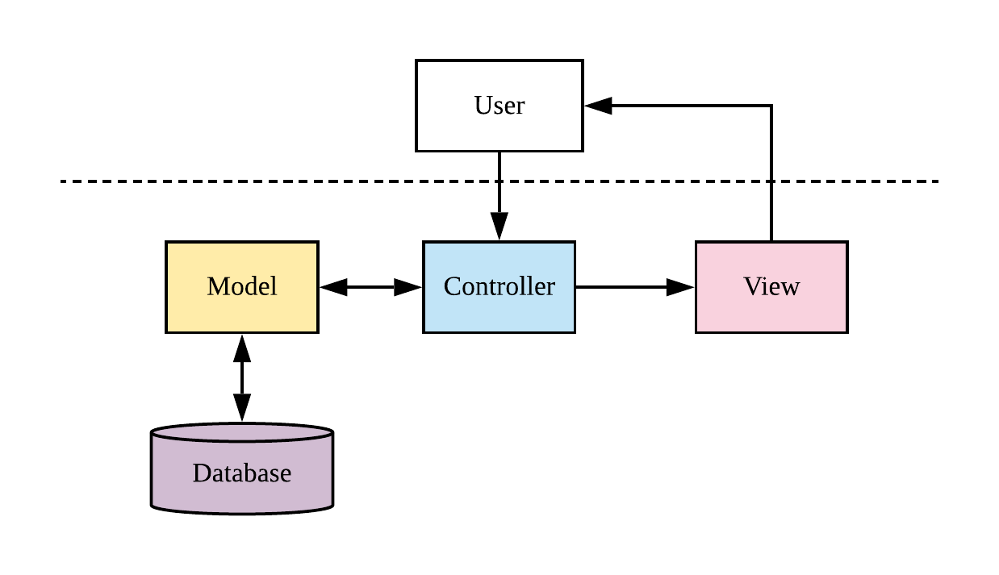

# Knewbie - Developer Guide

### Table of Contents
[1. Setting up](#setup)<br>
[2. Design](#design)<br>
&nbsp; &nbsp; [2.1. Architecture](#arch)<br>
&nbsp; &nbsp; [2.2. Model component](#model)<br>
&nbsp; &nbsp; [2.3. View component](#view)<br>
&nbsp; &nbsp; [2.4. Controller component](#control)<br>
[3. Implementation](#implement)<br>
[4. Frequently Asked Questions (FAQ)](#faq)<br>
[Testing](#test)<br>
[User Stories](#user)<br>

## 1. Setting up <a name="setup"></a>
Refer to the guide [here](https://github.com/R-Ramana/Knewbie/blob/master/README.md).

## 2. Design <a name="design"></a>

### 2.1 Architecture <a name="arch"></a>


The Model-View-Controller (MVC) is a software design pattern that divides the program logic into the components. The Web App consists of these three main components.
* [Model](#model): Manages data, logic and rules of application
* [View](#view): The representation to the users
* [Controller](#control): Converts input to commands for Model or View

### 2.2 Model component <a name="model"></a>
The Model component includes files:
```
├── forms.py
├── models.py
└── ...
```

The Model component
* stores `User` data.
* stores `Question` data.
* does not depend on the other components.

### 2.3 View component <a name="view"></a>
The View component includes folders:
```
├── templates
    └── ...
├── content
    └── ...
└── ...
``` 
The View component consists of the `HTML` templates along with `CSS` styling. 
Templates also have `Jinja` syntax, which is a templating language. 
Under the Flask framework, the `Jinja` syntax acts as part of the Controller component, changing the view logic depending on inputs from the Model component.

The View component
* Executes user commands using the Controller component
* Updates with changes to the Model data


### 2.4 Controller component <a name="control"></a>
The Controller component includes files:
```
├── views.py
├── decorator.py
├── questions.py
├── email.py
├── token.py
└── ...
```
The Controller component converts input from View to commands for Model and vice versa.
The files in this component consist of functions to control the logic of the application, ranging from email verification to quiz question generation.

## 3. Implementation <a name="implement"></a>

## Testing <a name="test"></a>

## User Stories <a name="user"></a>