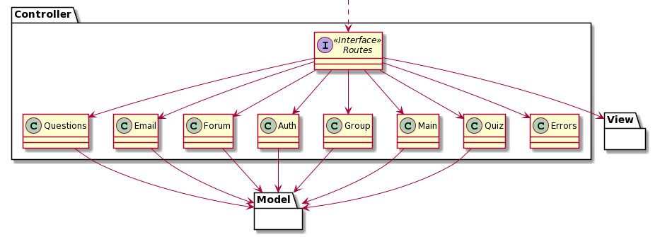
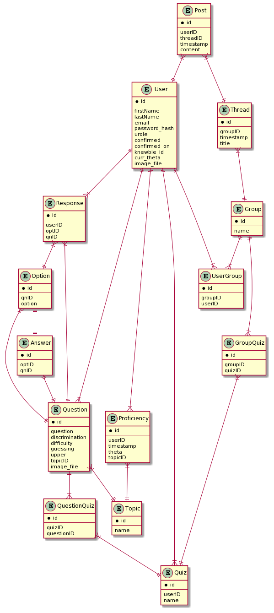
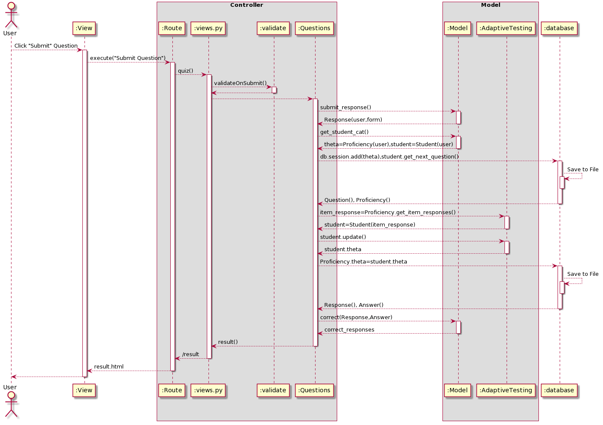
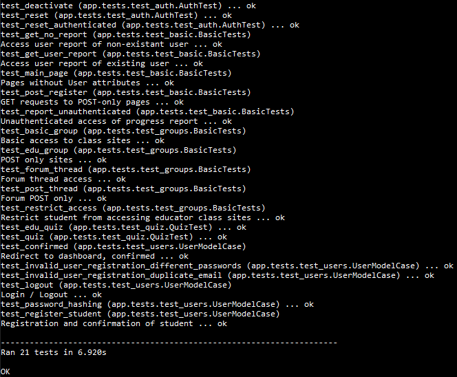

# Knewbie - Developer Guide

### Table of Contents
[1. Setting up](#setup)<br>
[2. Design](#design)<br>
&nbsp; &nbsp; [2.1. Architecture](#arch)<br>
&nbsp; &nbsp; [2.2. Model component](#model)<br>
&nbsp; &nbsp; [2.3. View component](#view)<br>
&nbsp; &nbsp; [2.4. Controller component](#control)<br>
&nbsp; &nbsp; [2.5. Database](#database)<br>
[3. Implementation](#implement)<br>
&nbsp; &nbsp; [3.1. User](#user)<br>
&nbsp; &nbsp; [3.2. Quiz](#quiz)<br>
&nbsp; &nbsp; [3.3. Adaptive Testing](#adaptive)<br>
[4. Documentation](#doc)<br>
[5. Testing](#test)<br>
[6. Frequently Asked Questions (FAQ)](#faq)<br>
[User Stories](#userstories)<br>

## 1. Setting up <a name="setup"></a>
Refer to the guide [here](/docs/InstallationGuide.md).

## 2. Design <a name="design"></a>
[Flask](https://flask.palletsprojects.com/) is a micro web framework written in [Python](https://www.python.org/). This Web App makes use of the framework for its overall design.
The rationale behind choosing Flask may be found in the [Development Practices document](/docs/DevPractices.md). 
The explanation of Diagrams used in this Guide can be found in the [Documentation section below](#doc).
### 2.1 Architecture <a name="arch"></a>

Fig #. Overall Architecture

The [Model-View-Controller (MVC)](https://en.wikipedia.org/wiki/Model%E2%80%93view%E2%80%93controller) is a software design pattern that divides the program logic into the components. While some of the components may have some overlap with the others due to the nature of the Flask framework design, the Web App can still be said to consist of these three main components.
* [Model](#model): Manages data, logic and rules of application
* [View](#view): The representation to the users
* [Controller](#control): Converts input to commands for Model or View

[CRUD (Create, read, update and delete)](https://en.wikipedia.org/wiki/Create,_read,_update_and_delete) are the 4 basic operations of persistent storage and will be a basis for all operations done.

The Web App will use the [RESTful API](https://restfulapi.net/) architectural style to perform its HTTP requests.

The *Sequence Diagram* below shows how a `POST` request for a `RegistrationForm` - registering for an account - will cause the different components to interact.

<br>
Fig #. Component Interactions for `register`

### 2.2 Model component <a name="model"></a>
The Model component includes files:
```
├── forms.py
├── models.py
├── cat.py
└── ...
```

<br>
Fig #. Structure of Model components

The Model component
* stores `User` data.
* stores `Question, Option, Answer` data.
* defines the various `FlaskForm`s used.
* defines `Student` used in CAT, explained under [Implementation](#adaptive)
* does not depend on the other components.

### 2.3 View component <a name="view"></a>
The View component includes folders (and all the files within them):
```
├── templates
    └── ...
├── content
    └── ...
└── ...
``` 
<br>
Fig #. Structure of View component

The View component consists of the `HTML` templates along with `CSS` styling. 
Templates also have `Jinja` syntax, which is a templating language. 
Under the Flask framework, the `Jinja` syntax acts as part of the Controller component, changing the view logic depending on inputs from the Model component.

The View component
* Executes user commands using the Controller component
* Updates with changes to the Model data


### 2.4 Controller component <a name="control"></a>
The Controller component includes files:
```
├── views.py
├── decorator.py
├── questions.py
├── email.py
├── token.py
├── forum.py
└── ...
```
<br>
Fig #. Structure of Controller Component

The Controller component converts input from View to commands for Model and vice versa.
The files in this component consist of functions to control the logic of the application, ranging from email verification to quiz question generation. It is important to note that in Flask, there is a file specific to route the various URLs along with their HTTP methods to the right function - which in this case is `views.py`. This function can display a webpage (View component), or redirect to another function. As such, the main interaction between the View and Controller component will happen here. The other files under the Controller component would then be mainly used to interact with the Model component.

1. Controller uses `views.py` to route the URL.
2. Correct route function is called (e.g. as a `GET` or `POST` request).
3. Function carried out can affect the Model.
4. The result will be seen in the View component as a `HTML` webpage, either from a redirect or an update to the WebPage itself.

The Sequence Diagram below shows the interactions within the Controller component for the submission of the `RegistrationForm` using a `POST` request from `/register`.

<br>
Fig #. Interactions within Controller Component for `register`

### 2.5 Database <a name="database"></a>
The database design is centered around the users, quizzes, and forum posts. The *Entity-Relationship (ER) Diagram* below showcases the attributes and relationships used. 
Explanation of the diagram can be found under the [Documentation section](#er).

<br>
Fig #. Database Design

## 3. Implementation <a name="implement"></a>
This section describes some noteworthy details on how certain features are implemented.
### 3.1 User <a name="user"></a>
#### 3.1.1 Registration
An overview of user registration had already been provided under the [Architecture](#arch) and [Controller](#control) sections earlier. In essence, it takes 4 steps:
1. Submission in View component
2. Validation check in Controller component
3. Register in Controller component
4. Create user in Model component
5. Save to database

In line with modern practices, there is also [email verification](https://ux.stackexchange.com/questions/111005/what-is-the-point-of-email-verification), which verifies that the email used belongs to whomever had registered.
Immediately after the above steps are taken, the User account is still unconfirmed, and certain features will not be accessible. Trying to do so will result in the following page.

<br>
Fig #. Unconfirmed webpage

Using the [`ItsDangerous`](https://itsdangerous.palletsprojects.com/) module, a token is generated and a clickable confirmation link will be available from the user's email.
From the [Database Design](#database), the `User` properties `confirmed` and `confirmed_on` will be updated when the account is confirmed, to be `True` and the current `datetime` respectively.
In case a user forgets their password, or had their account compromised, there is a reset password feature available. Similarly, the reset password feature also uses the same module to produce the secure tokens to provide the links used.

#### 3.1.2 Account Details
Account details include the user's login information, name, and statistics having to do with the quizzes. 
* Currently, there are 2 different types of a `User` that can register for an account in the application - Student and Educator.

Overall, account details can be retrieved simply by doing a `GET` request at the appropriate URLs provided that the user is authenticated.
Updating and/or deletion of the account can be explained quite similarly to the registration procedure mentioned, in that there is the submission, validation, and saving of the information being updated. <br>
{Screenshots to be added} <br>

#### 3.1.3 Contact Us
The Contact Us page is also another example of the `FlaskForm` being used - in this case to communicate with the technical team. Provided is the Sequence Diagram for a `POST` request for a `ContactForm`.

<br>
Fig #. Interactions of Components for a ContactForm

#### 3.1.4 Classes
Both Students and Educators can be part of Classes. Classes are created to let Educators monitor their students progress collectively, and also can allow interaction between Educators and Students as well as Students with other Students using the forum.
A simple demonstration of a Student-Educator relationship, along with the Classes is shown in the ER Diagram below.
Note that the User properties were omitted for brevity - the full database design can still be found earlier in the [Database section](#database).

<br>
Fig #. Relationship of Student-Educator-Class

In the creation of a Class, the Educator will input a name and click a button leading to it being saved in the database. Further information can be found in the User Guide (Educator).

Interactions between are part of peer learning and can enhance the knowledge gained from the platform. 
The forum created for each class will allow for the clarification of questions students may have.
The diagram above also demonstrates the relationships between the forum and users.

### 3.2 Quiz <a name="quiz"></a>
#### 3.2.1 Attempt Quiz
The quiz requires the use of an Adaptive Testing feature which aims to provide tailored content to suit the user's ability, explained in a [later section](#adaptive). 
Overall, there is a large similarity to previously mentioned features in terms of the interaction with the addition of the Adaptive Testing feature. 
Below is the Sequence Diagram in completing a quiz.

<br>
Fig #. Interactions of Components for a Quiz submission

#### 3.2.2 Create Quiz (Educator only)
In addition to tailored content, Educators can also create their own `Question` for their own Class. The ER Diagram below zooms in on the relationships used in the creation of quizzes by an Educator.

<br>
Fig #. Relationships of Educators and Quizzes

In creating a Quiz, and its questions, the interactions can be shown in the following Sequence Diagram.

{Create Quiz Sequence} <br>
Fig #. Interactions of Components for a Quiz Creation

When attempting a quiz created by an educator, it is different from the general quiz mentioned in the earlier Section 3.2.1. 
In this case, there is no adaptive testing, so the questions are given as they were added by the educator.
The User Guide (Educator) demonstrates the creation of such a quiz, and the User Guide (Student) showcases attempting the quiz.
To the Student, both quizzes are similar in front-end design. The only difference is the back-end implementation of retrieving the next question.


### 3.3 Adaptive Testing <a name="adaptive"></a>
Separate to quizzes created by an Educator, the platform also supports the following feature which allows tailored content in the quizzes.
[Computerized Adaptive Testing (CAT)](https://en.wikipedia.org/wiki/Computerized_adaptive_testing) is a form of test that adapts to the user's ability. 
[Item Response Theory (IRT)](https://en.wikipedia.org/wiki/Item_response_theory) provides a means to do so, 
and this project has decided on the use of the CatSim Python package. [More information can be found on their main documentation.](https://douglasrizzo.com.br/catsim/)

Under IRT, an examinee's proficiency is measured. In this web application, this corresponds to the students' proficiencies.
Each item administered - MCQ Math questions in this case - will have 4 main parameters used, detailed below:
* discimination - how well an item discriminates individuals who answer correctly and wrongly
* difficulty - same scale as proficiency, and determines which proficiency level the item would be more informative
* pseudo-guessing - probability low proficiency gets question correct
* upper asymptote - probability high proficiency gets question incorrect

More information on the parameters can be found on [CatSim's documentation](https://douglasrizzo.com.br/catsim/introduction.html). 

The general idea used when administering questions can be seen in the following flowchart. This algorithm is used in the general quizzes that will be taken by a student.
Educator-created quizzes do not use this feature and are detailed in the [earlier section](#quiz).

<br>
Fig #. Flowchart of general adaptive testing algorithm used

## 4. Documentation <a name="doc"></a>
The Diagrams in this Guide were created and defined with [PlantUML](https://plantuml.com/). The source code can be found in the [diagrams folder](/docs/diagrams).

### 4.1 Class and Sequence Diagrams <a name="class"></a>
The Class and Sequence Diagrams used have their own notation and can be explained with the help of the [CS2103 Software Engineering website](https://nus-cs2103-ay1920s2.github.io/website/se-book-adapted/chapters/uml.html#uml).

**Class Diagrams** include:
* Class Names 
* Attributes
* Methods

 <br>
Fig #. Class Diagram Notation<br>

**Sequence Diagrams** show the sequence of events as time events and include, for a specific operation:
* Entities
* Operations 
* Activation Bars 
* Lifelines 
* returned values

 <br>
Fig #. Sequence Diagram Notation<br>

### 4.2 Entity Relationship Diagrams <a name="er"></a>
The [Entity Relationship Diagrams](https://www.smartdraw.com/entity-relationship-diagram/) used to describe databases include:
* Entities - represented by rectangles, properties can be found listed right after the primary key property
* Relationships - represented by diamonds
* Cardinality - using the Information Engineering Style for its notation

 <br>
Fig #. Entity Relationship Diagram Notation <br>


## 5. Testing <a name="test"></a>
[](https://travis-ci.org/Orbital-Knewbie/Knewbie)
[](https://codecov.io/gh/Orbital-Knewbie/Knewbie)<br>
With the constant updates to the code, there is a need to conduct [Unit Testing](https://en.wikipedia.org/wiki/Unit_testing) to ensure that sections of the code continue to work.
This project uses the `unittest` module provided by Python to carry out the tests. As an example of testing, using the following command, we will be able to see our test results from the command line.
```
nose2 -v
```

<br>
Fig #. Unit Testing Knewbie<br>

[Codecov](https://codecov.io/) is a tool that goes hand in hand with Unit Testing, and will check for the test coverage of the codebase, based on the Unit Tests.
This allows the developers to understand which areas of the code may need more attention and possibly rigorous testing.

Along with the Unit Tests, the project also [Travis CI](https://travis-ci.org/), which allows [Integration Tests](https://en.wikipedia.org/wiki/Integration_testing) to be done when merging code while using version control.
Together with the protection of the master branch, Travis then ensures that bugs that affects the building of projects to be caught.


## 6. Frequently Asked Questions (FAQ) <a name="faq"></a>

## User Stories <a name="userstories"></a>
Priorities: High (must have) - `* * *`, Medium (good to have) - `* *`, Low (not significant) - `*`

Priority | As a ... | I want to ... | So that I can...
--- | --- | --- | ---
`* * *` |**{target user}** | **{feature}** | **{aim of the project}**
`* * *` | new student | create an account | log in and access the features of the application
`* * *` | student | log in | access the personalized features such as the tailored quizzes on the web application
`* * *` | student | attempt the (topical) quizzes |  practise more questions than those I usually get
`* * *` | user (student/educator) | be able to change my password | have it not be compromised 
`* * *` | user (student/educator) | deactivate my account when I no longer need it | prevent unauthorized access to my account information
`* * *` | new user | receive an email verification | ensure my account email is correct
`* *` | generic user | read the frequently asked questions | see responses for common issues people may face
`* *` | generic user | contact the technical team via email | raise a technical issue not in the frequently asked questions
`* *` | student | view my progress report | keep track of my learning
`* *` | student | change my Knewbie ID | have it not be compromised 
`* * *` | student | be tested with tailored content as a quiz | cater to my learning abilities
`* *` | student | join a class | participate in learning with my educator and classmates
`*` | student | view my classmate’s progress | know who to approach if I have queries
`* *` | student | ask questions on a forum | clear any doubts
`* *` | student | view questions my friends have asked | read important questions to understand, but questions which I did not think of
`* *` | student | help answer my peer’s questions | have a slightly better understanding of the topic
`* *` | student | edit my post | fix my typos
`* *` | student | delete my post | remove unwanted posts
`* *` | educator | read my students’ queries | respond to them
`* *` | educator | respond to my students’ queries | clarify doubts
`* *` | educator | edit my replies | clarify my response
`* *` | educator | delete hurtful comments and posts | remove inappropriate comments
`* *` | educator | create a group | effectively and efficiently teach my students
`* *` | educator | kick participants out of the class | remove “intruders”
`*` | educator | delete my classes that are no longer in use | keep my dashboard au courant
`* *` | educator | change my class code that students require to join the class | prevent intrusions
`* *` | educator | viewing my students' progress reports | monitor their progress
`*` | educator | create more questions | have my students practise them
`* *` | educator | update the questions I have created | fix a typo
`* *` | educator | delete questions I created | remove irrelevant questions
`* *` | parent | view my child’s progress | be more involved in his/her learning
`* *` | existing educator | update students enrolled in my class | track their progress in the application

