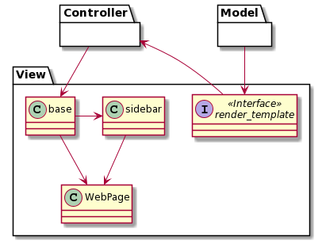

# Knewbie - Developer Guide

### Table of Contents
[1. Setting up](#setup)<br>
[2. Design](#design)<br>
&nbsp; &nbsp; [2.1. Architecture](#arch)<br>
&nbsp; &nbsp; [2.2. Model component](#model)<br>
&nbsp; &nbsp; [2.3. View component](#view)<br>
&nbsp; &nbsp; [2.4. Controller component](#control)<br>
&nbsp; &nbsp; [2.5. Database](#database)<br>
[3. Implementation](#implement)<br>
[4. Documentation](#doc)<br>
[5. Testing](#test)<br>
[6. Frequently Asked Questions (FAQ)](#faq)<br>
[User Stories](#user)<br>

## 1. Setting up <a name="setup"></a>
Refer to the guide [here](https://github.com/R-Ramana/Knewbie/blob/master/README.md).

## 2. Design <a name="design"></a>
[Flask](https://flask.palletsprojects.com/) is a micro web framework written in [Python](https://www.python.org/). This Web App makes use of the framework for its overall design.
### 2.1 Architecture <a name="arch"></a>

Fig #. Overall Architecture

The [Model-View-Controller (MVC)](https://en.wikipedia.org/wiki/Model%E2%80%93view%E2%80%93controller) is a software design pattern that divides the program logic into the components. While some of the components may have some overlap with the others due to the nature of the Flask framework design, the Web App can still be said to consist of these three main components.
* [Model](#model): Manages data, logic and rules of application
* [View](#view): The representation to the users
* [Controller](#control): Converts input to commands for Model or View

The Web App will use the [RESTful API](https://restfulapi.net/) architectural style to perform its HTTP requests.

The *Sequence Diagram* below shows how a `POST` request for a `RegistrationForm` - registering for an account - will cause the different components to interact.

<br>
Fig #. Component Interactions for `register`

### 2.2 Model component <a name="model"></a>
The Model component includes files:
```
├── forms.py
├── models.py
└── ...
```

<br>
Fig #. Structure of Model components

The Model component
* stores `User` data.
* stores `Question` data.
* defines the various `FlaskForm`s used.
* does not depend on the other components.

### 2.3 View component <a name="view"></a>
The View component includes folders (and all the files within them):
```
├── templates
    └── ...
├── content
    └── ...
└── ...
``` 
<br>
Fig #. Structure of View component

The View component consists of the `HTML` templates along with `CSS` styling. 
Templates also have `Jinja` syntax, which is a templating language. 
Under the Flask framework, the `Jinja` syntax acts as part of the Controller component, changing the view logic depending on inputs from the Model component.

The View component
* Executes user commands using the Controller component
* Updates with changes to the Model data


### 2.4 Controller component <a name="control"></a>
The Controller component includes files:
```
├── views.py
├── decorator.py
├── questions.py
├── email.py
├── token.py
└── ...
```
<br>
Fig #. Structure of Controller Component

The Controller component converts input from View to commands for Model and vice versa.
The files in this component consist of functions to control the logic of the application, ranging from email verification to quiz question generation. It is important to note that in Flask, there is a file specific to route the various URLs along with their HTTP methods to the right function - which in this case is `views.py`. This function can display a webpage (View component), or redirect to another function. As such, the main interaction between the View and Controller component will happen here. The other files under the Controller component would then be mainly used to interact with the Model component.

1. Controller uses `views.py` to route the URL.
2. Correct route function is called (e.g. as a `GET` or `POST` request).
3. Function carried out can affect the Model.
4. The result will be seen in the View component as a `HTML` webpage, either from a redirect or an update to the WebPage itself.

The Sequence Diagram below shows the interactions within the Controller component for the submission of the `RegistrationForm` using a `POST` request from `/register`.

<br>
Fig #. Interactions within Controller Component for `register`

### 2.5 Database <a name="database"></a>
The database design is centered around the users, quizzes, and forum posts (to be added). The *Entity-Relationship Diagram* below showcases the attributes and relationships used.

<br>
Fig #. Database Design

## 3. Implementation <a name="implement"></a>
This section describes some noteworthy details on how certain features are implemented.
### 3.1 Account Management
#### 3.1.1 Registration
An overview of user registration had already been provided under the [Architecture](#arch) and [Controller](#control) sections earlier. In essence, it takes 4 steps:
1. Submission in View component
2. Validation check in Controller component
3. Register in Controller component
4. Create user in Model component
5. Save to database

In line with modern practices, there is also [email verification](https://ux.stackexchange.com/questions/111005/what-is-the-point-of-email-verification), which verifies that the email used belongs to whomever had registered.
Immediately after the above steps are taken, the User account is still unconfirmed, and certain features will not be accessible. Trying to do so will result in the following page.

<br>
Fig #. Unconfirmed webpage

Using the [`ItsDangerous`](https://itsdangerous.palletsprojects.com/) module, a token is generated and a clickable confirmation link will be available from the user's email.
From the [Database Design](#database), the `User` properties `confirmed` and `confirmed_on` will be updated when the account is confirmed, to be `True` and the current `datetime` respectively.

#### 3.1.2 Progress Report

#### 3.1.3 Update Account Details

#### 3.1.4 Deactivate Account

### 3.2 Quizzes
#### 3.2.1 Attempt Quiz

#### 3.2.2 Create Quiz (Educator only)


## 4. Documentation <a name="doc"></a>

## 5. Testing <a name="test"></a>

## 6. Frequently Asked Questions (FAQ) <a name="faq"></a>

## User Stories <a name="user"></a>
Priorities: High (must have) - `* * *`, Medium (good to have) - `* *`, Low (not significant) - `*`

Priority | As a ... | I want to ... | So that I can...
--- | --- | --- | ---
 `* * *` |{target user} | {feature} | {aim of the project}
`* * *` | new student | create an account | log in and access the features of the application
`* * *` | student | log in | access the personalized features such as the tailored quizzes on the web application
`* * *` | student | attempt the (topical) quizzes |  
`* * *` | user (student/educator) | I want to be able to change my password | have it not be compromised 
`* * *` | user (student/educator) | I want to deactivate my account when I no longer need it | people cannot gain unauthorized access to my account information
`* *` | user | read the frequently asked questions | see responses for common issues people may face
`* *` | user | contact the developers | raise a technical issue not in the frequently asked questions
`* *` | student | view my progress report | keep track of my learning
`* *` | student | change my Knewbie ID | have it not be compromised 
`*` | student | view my classmate’s progress | know who to approach if I have queries
`* *` | student | ask questions on a forum | clear any doubts
`* *` | student | view questions my friends have asked | read important questions to understand, but questions which I did not think of
`* *` | student | help answer my peer’s questions | have a slightly better understanding of the topic
`* *` | student | to edit my post | fix my typos
`* *` | student | delete my post | remove unwanted posts
`* *` | educator | read my students’ queries |
`* *` | educator | respond to my students’ queries |
`* *` | educator | edit my replies | clarify my response
`* *` | educator | delete hurtful comments and posts | remove inappropriate comments
`* *` | educator | create a group | effectively and efficiently teach my students
`* *` | educator | kick participants out of the class | remove “intruders”
`*` | educator | delete my classes that are no longer in use | keep my dashboard au courant
`* *` | educator | change my class code that students require to join the class | intrusions are prevented
`* *` | educator | viewing my students' progress reports | monitor their progress
`*` | educator | create more questions | my students can practise
`* *` | educator | update the questions I have created | fix a typo
`* *` | educator | delete questions | 
`* *` | parent | view my child’s progress | be more involved in his/her learning
`* *` | existing educator | update students enrolled in my class | track their progress in the application
`* * *` | student | log in to access tailored content as a quiz | cater to my learning abilities
