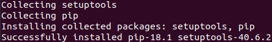
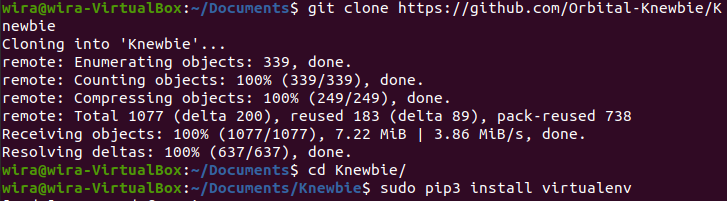
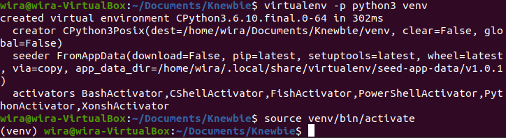
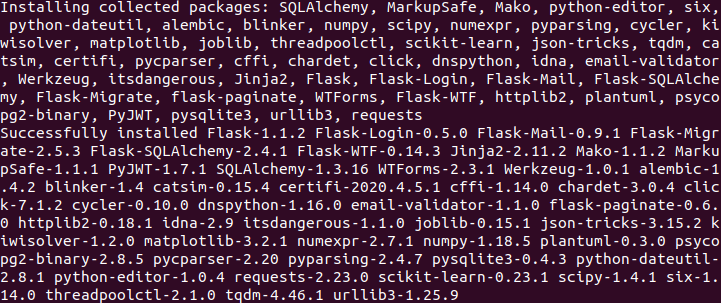

# Installation

### Prerequisites
* [Git](https://git-scm.com/)
* [Python 3](https://www.python.org/downloads/)
###### Windows only
* [Windows Subsystem for Linux (WSL)](https://docs.microsoft.com/en-us/windows/wsl/install-win10)

### Pre-Installation
#### Rationale
Due to the convenience of the Linux command line, and the fact that the developers are primarily using Windows, it was decided that WSL was chosen as the [CLI](https://en.wikipedia.org/wiki/Command-line_interface) with which this application is developed.
As such, the instructions given will be mostly catered to the WSL environment, but Windows commands will also be covered. macOS is currently not covered in this guide. 
Python 3.6 was also chosen for development as it is the [default version used on Ubuntu](https://wiki.ubuntu.com/Python) - the Linux distribution WSL uses. 
While other Python 3 versions should still be able to support the application, their compatibility is not guaranteed.

#### Commands
Setting up on WSL notably produces some errors if the installation steps were to be taken immediately. This section will try to help prevent this by providing the commands taken before actual installation.
1. [A common `apt hook` error that appears on WSL](https://askubuntu.com/questions/1123159/broken-apt-on-wsl-18-04) can be fixed by removing it. You may want to save a backup just in case.
###### WSL only
```
sudo rm -rf /etc/apt/apt.conf.d/20snapd.conf
```
2. Due to the [Common Build Problems using `pyenv`](https://github.com/pyenv/pyenv/wiki/Common-build-problems), if using Ubuntu/WSL, there is a need to install packages before getting started. 
See this [StackOverflow answer](https://stackoverflow.com/questions/39907475/cannot-import-sqlite3-in-python3) for more information regarding the commands used.
###### Ubuntu/WSL only
```
sudo apt-get install -y build-essential libssl-dev zlib1g-dev libbz2-dev \
libreadline-dev libsqlite3-dev wget curl llvm libncurses5-dev libncursesw5-dev \
xz-utils tk-dev libffi-dev liblzma-dev python-openssl git
```
```
sudo apt-get remove python3.6
```
```
cd /tmp && wget https://www.python.org/ftp/python/3.6.10/Python-3.6.10.tgz
tar -xvf Python-3.6.10.tgz
cd Python-3.6.10 && ./configure
make && sudo make install
```
<br>
Successful Installation of Python 3.6.10

### Installing
Commands given should be carried out on the command line. Commands were tested on Windows and [WSL](https://docs.microsoft.com/en-us/windows/wsl/about) and Python 3.6 was used for development.


1. Clone this repo and enter the folder.
###### Both Linux/WSL and Windows
```
git clone https://github.com/Orbital-Knewbie/Knewbie
cd Knewbie
```
<br>
Cloning into the Knewbie repo
!
2. Install, then create a Python 3 `virtualenv`.
###### Linux/WSL only
```
sudo pip3 install virtualenv
virtualenv -p python3 venv
```
###### Windows only
```
pip install virtualenv
virtualenv venv
```
3. Enter ```virtualenv```.
###### Linux/WSL only
```
source venv/bin/activate
```
<br>
Entering the `virtualenv`
###### Windows only
```
venv\Scripts\activate
```
5. Install dependencies. If there are missing modules, it can likely be fixed with `pip install`.
###### Both Linux/WSL and Windows
```
pip install -r requirements.txt
```

Sucessful Installation of `requirements.txt` packages

6. Set the environment variable. Note that there is no spacing around `=`.
###### Linux/WSL only
```
export FLASK_APP=run.py
```
###### Windows only
```
set FLASK_APP=run.py
```
7. Run the application.
###### Both Linux/WSL and Windows
```
flask run
```
8. Open up `localhost:5000` on a browser of your choice. You should see the homepage. Do read the [User Guide (Educator)](UserGuide-Educator.md) or [User Guide (Student)](UserGuide-Students.md) for guidance on the web application usage, and subsequently the [Developer Guide](DeveloperGuide.md) for Design and Implementation details.


## Built With

* [Flask](https://flask.palletsprojects.com/en/1.1.x/) - The web framework used
