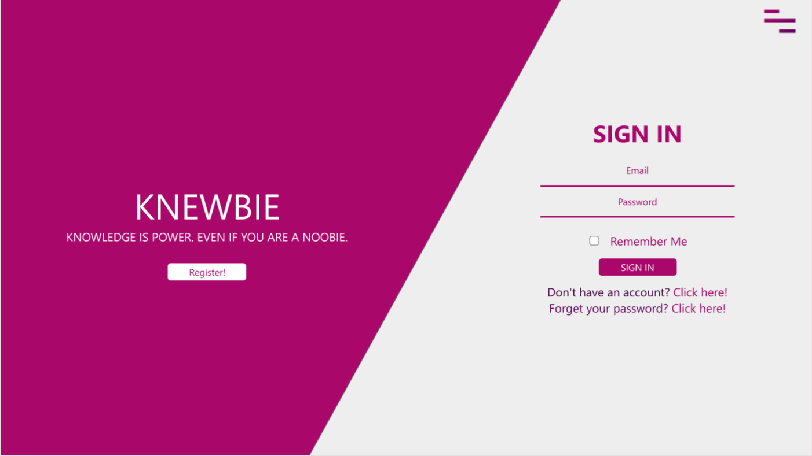
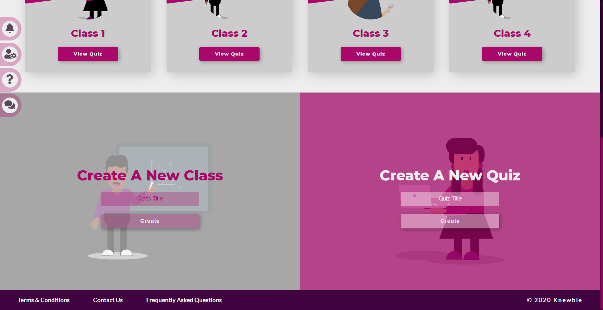

# Knewbie - Educator's User Guide

### Table of Contents
[1. Introduction](#intro)  
[2. Quick Start](#quickstart) 
[3. Features](#features) 
&nbsp; &nbsp; [3.1. Reset Password](#pw) 
&nbsp; &nbsp; [3.2. Classes](#class) 
&nbsp; &nbsp; &nbsp; &nbsp; [3.2.1. Creating A Class](#create) 
&nbsp; &nbsp; &nbsp; &nbsp; [3.2.2. Creating A Quiz](#qn) 
&nbsp; &nbsp; &nbsp; &nbsp; [3.2.3. Leaderboard/Progress Report](#score) 
&nbsp; &nbsp; &nbsp; &nbsp; [3.2.4. Forum](#forum) 
&nbsp; &nbsp; &nbsp; &nbsp; [3.2.5. Edit Participants List](#edit) 
&nbsp; &nbsp; &nbsp; &nbsp; [3.2.6. Change Class Code](#code) 
&nbsp; &nbsp; &nbsp; &nbsp; [3.2.7. Delete Class](#delete) 
&nbsp; &nbsp; [3.3. Profile Customization](#customize) 
&nbsp; &nbsp; &nbsp; &nbsp; [3.3.1. Profile Settings](#profile) 
&nbsp; &nbsp; &nbsp; &nbsp; [3.3.2. Account Settings](#account) 
[4. Frequently Asked Questions (FAQ)](#faq)

## <a name="intro">1. Introduction</a> 
Knewbie is an educational platform that provides tailored content to suit the individual's learning ability. Through the usage of our machine learning algorithm, students will be recommended content based on their current abilities to ensure that they progress at a steady rate and are not exposed to content which they are unable to do from the get go. Hence, this will provide motivation for students where they will be able to celebrate their small successes before gradually, attempting tougher challenges. Read on to find out how to use Knewbie.

## <a name="quickstart">2. Quick Start</a> 
1. Access the Knewbie website [here]. (Currently not up yet)

2. Click on register to create a new account. Please note, you will need an active email account. If you do not already have one, please create an email before continuing.

3. As an Educator, remember to switch your view to the Educator registration form. 

{Switch view image}

4. Enter your **FIRST NAME, LAST NAME**, email, password and click on the register button. Please note, by clicking on the register button, you would have agreed to our terms and conditions as listed [here]. (Not up yet)

{Educator register image}

5. If you have followed the instructions correctly, you will receive a verification link sent to the email address you registered the account with.

6. Log in to the email and click on the link to verify your account.

6. You can now successfully log in using your email and password to access all the features available on our platform!

## <a name="features">3. Features</a> 
### <a name="pw"> &nbsp; &nbsp; 3.1. Reset Password</a> 
&nbsp; &nbsp; &nbsp; &nbsp; 1. If you have forgotten your password, or want to change it, you can do so through this [link]. (Not Up Yet)

&nbsp; &nbsp; &nbsp; &nbsp; 2. To change your password input the email address you created your account with.

&nbsp; &nbsp; &nbsp; &nbsp; 3. A link will be sent your email address. This link will only be valid for 10 minutes.  
&nbsp; &nbsp; &nbsp; &nbsp; &nbsp; &nbsp; If the link expired, you will have to request for a new one.

&nbsp; &nbsp; &nbsp; &nbsp; 4. Log in to your email account and click on the link.

&nbsp; &nbsp; &nbsp; &nbsp; 5. You will be taken to a page to change your password.

### <a name="class"> &nbsp; &nbsp; 3.2. Classes</a> 
&nbsp; &nbsp; &nbsp; &nbsp; 1. When you have logged in to your acocunt, you will be able to view all your create classes from your dashboard.

&nbsp; &nbsp; &nbsp; &nbsp; 2. When you first begin, you will not have any classes.

#### <a name="create"> &nbsp; &nbsp; &nbsp; &nbsp; 3.2.1. Creating A Class</a> 
&nbsp; &nbsp; &nbsp; &nbsp; &nbsp; &nbsp; 1. To create a class, scroll down to the bottom of your dashboard, or click on create under the dashboard.

&nbsp; &nbsp; &nbsp; &nbsp; &nbsp; &nbsp; 2. Enter a class name under the 'Create A Class' heading and click on the create button.

&nbsp; &nbsp; &nbsp; &nbsp; &nbsp; &nbsp; 3. A unique class code and passcode will be displayed. Share both information with the students you would like to participate in the class.

#### <a name="qn"> &nbsp; &nbsp; &nbsp; &nbsp; 3.2.2. Creating A Quiz</a> 
&nbsp; &nbsp; &nbsp; &nbsp; &nbsp; &nbsp; 1. Similarly to creating a class, you can create a quiz which can be assigned to various classes which is under your purview.

&nbsp; &nbsp; &nbsp; &nbsp; &nbsp; &nbsp; 2. Enter a class name under the 'Create A Class' heading and click on the create button.

&nbsp; &nbsp; &nbsp; &nbsp; &nbsp; &nbsp; 3. You will be taken to a new page to create the questions in your quiz.

&nbsp; &nbsp; &nbsp; &nbsp; &nbsp; &nbsp; 4. Currently we only support MCQs. Any question you submit will be stored in our database and may appear in our tailored content.

&nbsp; &nbsp; &nbsp; &nbsp; &nbsp; &nbsp; 5. Input all the relevant fields, add an image if required and click on 'Save and add a new question'.

&nbsp; &nbsp; &nbsp; &nbsp; &nbsp; &nbsp; 6. If this is the last question in the quiz, click on 'Save and complete quiz'.

&nbsp; &nbsp; &nbsp; &nbsp; &nbsp; &nbsp; 7. Upon successful creation, you will be redirected to a page where you can preview your quiz and make relevant changes if needed.

&nbsp; &nbsp; &nbsp; &nbsp; &nbsp; &nbsp; 8. On the same page you are able to assign the quiz to the classes you have as well, or even create a new quiz.

#### <a name="score"> &nbsp; &nbsp; &nbsp; &nbsp; 3.2.3. Leaderboard/Progress Report</a> 
&nbsp; &nbsp; &nbsp; &nbsp; &nbsp; &nbsp; 1. You will be able to view the individual progress report of all the students in your class. This includes the scores from quizzes attempted within and outtside of the class.

&nbsp; &nbsp; &nbsp; &nbsp; &nbsp; &nbsp; 2. The leaderboard is sorted based on overall proficiency.

#### <a name="forum"> &nbsp; &nbsp; &nbsp; &nbsp; 3.2.4. Forum</a> 
&nbsp; &nbsp; &nbsp; &nbsp; &nbsp; &nbsp; 1. Every class comes with a Forum.

&nbsp; &nbsp; &nbsp; &nbsp; &nbsp; &nbsp; 2. You are free to use the forum to post announcements, instructions and any other message you deem to be necessary.

&nbsp; &nbsp; &nbsp; &nbsp; &nbsp; &nbsp; 3. The main forum page will display the timestamp of the last post the number of posts as well as the title of the threads.

&nbsp; &nbsp; &nbsp; &nbsp; &nbsp; &nbsp; 4. Students will be able to post a new threads and reply to clarify doubts.

&nbsp; &nbsp; &nbsp; &nbsp; &nbsp; &nbsp; 5. As an educator and class creator, you have the right to delete any thread or post you deem inappropriate.

&nbsp; &nbsp; &nbsp; &nbsp; &nbsp; &nbsp; 6. To create a new thread, you have to click on the 'Create A New Thread' button near the top of the page.

&nbsp; &nbsp; &nbsp; &nbsp; &nbsp; &nbsp; 7. You will be taken to a new page where you need to input the title of the thread and the message.

&nbsp; &nbsp; &nbsp; &nbsp; &nbsp; &nbsp; 8. Clicking on post will make your post live.

&nbsp; &nbsp; &nbsp; &nbsp; &nbsp; &nbsp; 9. To view the content of a thread from the forum, you have to click on the thread title.

&nbsp; &nbsp; &nbsp; &nbsp; &nbsp; &nbsp; 10. You will be able to view the message along with all the other replies.

&nbsp; &nbsp; &nbsp; &nbsp; &nbsp; &nbsp; 11. You will also be able to post a reply, or edit your posts.

#### <a name="edit"> &nbsp; &nbsp; &nbsp; &nbsp; 3.2.5. Edit Participants List</a> 
&nbsp; &nbsp; &nbsp; &nbsp; &nbsp; &nbsp; 1. As an educator, you can edit the participants list.

&nbsp; &nbsp; &nbsp; &nbsp; &nbsp; &nbsp; 2. You can manually add or remove participants.

#### <a name="code"> &nbsp; &nbsp; &nbsp; &nbsp; 3.2.6. Change Class Code</a> 
&nbsp; &nbsp; &nbsp; &nbsp; &nbsp; &nbsp; 1. As an educator, you can request to change the class code.

&nbsp; &nbsp; &nbsp; &nbsp; &nbsp; &nbsp; 2. Use this feature sparingly and only if you suspect that your class has been encroached.

&nbsp; &nbsp; &nbsp; &nbsp; &nbsp; &nbsp; 3. To change the class code, just click on 'Change Class Code' which can be found on the class' sidebar.

#### <a name="delete"> &nbsp; &nbsp; &nbsp; &nbsp; 3.2.7. Delete Class</a> 
&nbsp; &nbsp; &nbsp; &nbsp; &nbsp; &nbsp; 1. As an educator, you can delete the class.

&nbsp; &nbsp; &nbsp; &nbsp; &nbsp; &nbsp; 2. Use this feature sparingly and only if you are sure you do not need the class any longer.

&nbsp; &nbsp; &nbsp; &nbsp; &nbsp; &nbsp; 3. This action is irrevocable.

&nbsp; &nbsp; &nbsp; &nbsp; &nbsp; &nbsp; 4. To delete the class, just click on 'Delete Class' which can be found on the class' sidebar.

&nbsp; &nbsp; &nbsp; &nbsp; &nbsp; &nbsp; 5. You will be redirected and asked to input your class code which could be found on the sidebar of your class.

&nbsp; &nbsp; &nbsp; &nbsp; &nbsp; &nbsp; 6. Upon confirmation of the request, all information associated with the class will be deleted.

### <a name="customize"> &nbsp; &nbsp; 3.3. Profile Customization</a> 
#### <a name="profile"> &nbsp; &nbsp; &nbsp; &nbsp; 3.3.1. Profile Settings</a> 
&nbsp; &nbsp; &nbsp; &nbsp; &nbsp; &nbsp; 1. You will be able to change certain features from your profile. 

&nbsp; &nbsp; &nbsp; &nbsp; &nbsp; &nbsp; 2. When logged in, you can access the settings page from the sidebar directly from your various classes or your dashboard.

&nbsp; &nbsp; &nbsp; &nbsp; &nbsp; &nbsp; 3. In the default settings page, you can make changes to your first name, last name, profile picture (avatar). Click 'SAVE'.

&nbsp; &nbsp; &nbsp; &nbsp; &nbsp; &nbsp; 5. The account tab is where you can change your password, or email associated with your Knewbie Account.

#### <a name="account"> &nbsp; &nbsp; &nbsp; &nbsp; 3.3.2. Account Settings</a> 

&nbsp; &nbsp; &nbsp; &nbsp; &nbsp; &nbsp; 1. It is also where you can deactivate your account. This action is irrevocable.

&nbsp; &nbsp; &nbsp; &nbsp; &nbsp; &nbsp; 2. Clicking on it will bring you to a page where you would need to input your email to confirm deactivation of your account.

&nbsp; &nbsp; &nbsp; &nbsp; &nbsp; &nbsp; 3. Upon entering your email, a link will be sent to the email you enterd.

&nbsp; &nbsp; &nbsp; &nbsp; &nbsp; &nbsp; 4. The email will contain a link to confirm your deactivation. The link will last for 10 minutes.

&nbsp; &nbsp; &nbsp; &nbsp; &nbsp; &nbsp; 5. Your account will officially be deactivated upon clicking on the link.

## <a name="faq">4. Frequently Asked Questions (FAQ)</a> 
1. You can access the list of FAQ through the link at the footer (bottom of every page), the navigation bar, or through this link. (not up yet)

2. If you have a question, issue or feedback not listed here, please do not hesitate to contact us. Similarly to the FAQ page, you can access the contact us page either through the link at the footer, the navigation bar or through this link. (not up yet)

